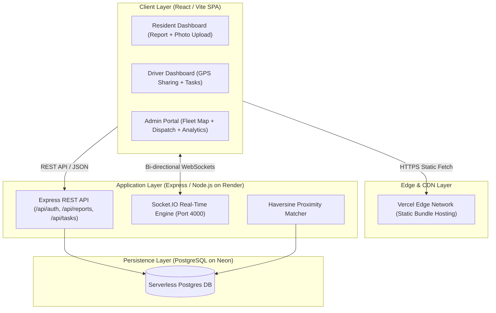
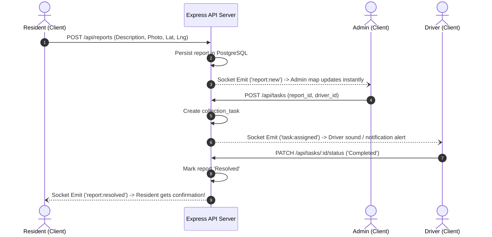

# System Architecture & Technical Specifications

This document provides an in-depth architectural breakdown of the **ESWAMA Real-Time Waste Management and Tracking System**, outlining data flows, WebSockets, client-server design, and spatial tracking algorithms.

---

## 1. System Topology & Component Layout

---

## 2. Real-Time Communication Architecture (Socket.IO)

Bi-directional communication is facilitated using persistent WebSocket connections over `Socket.IO`. 

### 2.1 Room & Channel Partitioning

| Channel / Room | Target Audience | Trigger Events | Description |
| :--- | :--- | :--- | :--- |
| `role:admin` | All logged-in Admins | `report:new` | Broadcasts new waste reports submitted by residents in real time. |
| `role:admin` | All logged-in Admins | `location:update` | Pushes live coordinates of active collection trucks to the fleet map. |
| `user:<driver_id>` | Specific Driver | `task:assigned` | Alerts a driver that a new collection task has been assigned to them. |
| `user:<resident_id>`| Specific Resident | `report:resolved` | Notifies the resident when their reported waste dump has been cleared. |

### 2.2 Event Lifecycle Flow

---

## 3. REST API Endpoint Catalog

### Authentication (`/api/auth`)
- `POST /api/auth/register` — Register a new resident account.
- `POST /api/auth/login` — Authenticate and receive JWT token.
- `GET /api/auth/me` — Retrieve currently logged-in user profile.
- `GET /api/auth/users` — List all registered system users (Admin only).
- `POST /api/auth/users` — Provision a new Admin or Driver (Admin only).
- `PATCH /api/auth/users/:id/status` — Toggle user status (`Active` / `Suspended`) (Admin only).
- `DELETE /api/auth/users/:id` — Delete user account (Admin only).

### Waste Reports (`/api/reports`)
- `POST /api/reports` — Submit waste issue with GPS pin & Base64 photo.
- `GET /api/reports` — List user reports (Residents) or all reports (Admins).
- `GET /api/reports/:id` — Fetch single report details.
- `PATCH /api/reports/:id/status` — Update report status (`Pending`, `Assigned`, `Resolved`).

### Tasks & Dispatch (`/api/tasks`)
- `GET /api/tasks` — List collection tasks for logged-in driver.
- `GET /api/tasks/nearest-driver` — Calculate nearest driver using Haversine algorithm.
- `POST /api/tasks` — Assign task to driver.
- `PATCH /api/tasks/:id/status` — Advance task status (`In Progress`, `Completed`).

### Fleet & Geolocation (`/api/locations`)
- `POST /api/locations` — Driver pushes real-time GPS coordinate breadcrumb.
- `GET /api/locations/latest` — Fetch latest recorded coordinates for all fleet vehicles.

### Analytics & Reports (`/api/analytics`)
- `GET /api/analytics` — Aggregated report statistics, resolution times, and driver performance.

### Notifications (`/api/notifications`)
- `GET /api/notifications` — Fetch recent notification history.
- `PATCH /api/notifications/:id/read` — Mark notification as read.
