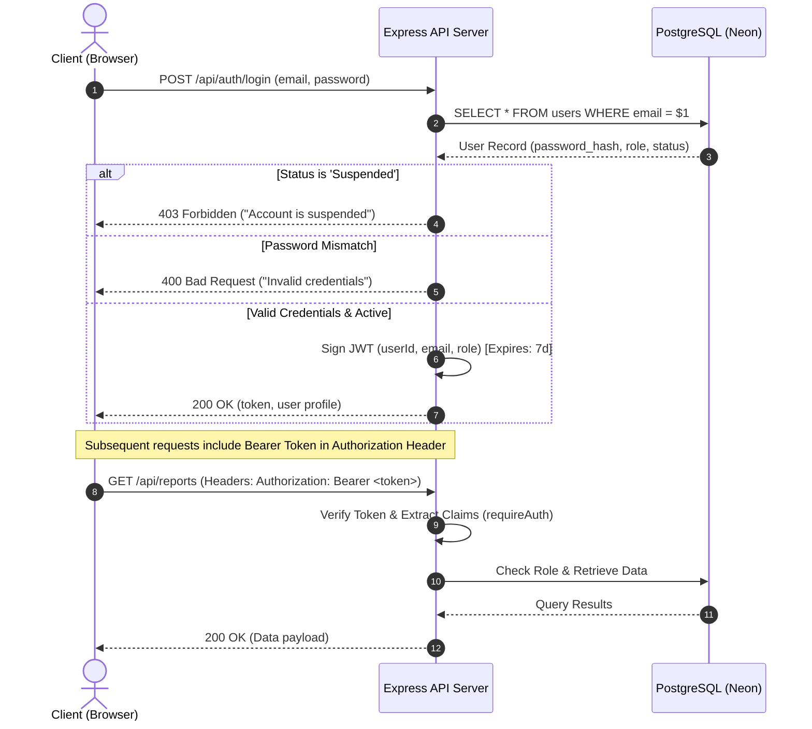

# Authentication & Authorization Architecture

This document details the security and identity management framework implemented in the **ESWAMA Waste Management and Tracking System**.

---

## 1. Security Overview

The ESWAMA system uses a stateless, token-based authentication mechanism powered by **JSON Web Tokens (JWT)** and **Bcrypt password hashing**, complemented by Role-Based Access Control (RBAC) and real-time account status enforcement.



---

## 2. Password Hashing Specification

- **Algorithm:** `bcrypt` (Blowfish-based cipher)
- **Salt Work Factor:** `10` rounds
- **Collision Resistance:** Salts are generated per-user automatically during hashing.
- **Storage:** Plaintext passwords are never logged, cached, or persisted.

---

## 3. Role-Based Access Control (RBAC) Matrix

The system enforces strict permission boundaries across three primary roles:

| Feature / Resource | Resident | Driver | Admin |
| :--- | :---: | :---: | :---: |
| **Self Registration** |  Yes |  No (Admin Only) |  No (Admin Only) |
| **Submit Waste Reports + Photos** |  Yes |  No |  No |
| **View Personal Report History** |  Yes |  No |  No |
| **View Live Waste Reports Feed** |  No |  No |  Yes |
| **Nearest Driver Suggestion Engine** |  No |  No |  Yes |
| **Assign Collection Tasks** |  No |  No |  Yes |
| **Driver Location Streaming** |  No |  Yes |  No |
| **View Live Municipal Fleet Map** |  No |  Yes (Assigned) |  Yes (All Vehicles) |
| **Advance Task Status (In Progress / Completed)** |  No |  Yes |  Yes |
| **User Management (Create, Suspend, Delete)** |  No |  No |  Yes |
| **Analytics & Reporting Dashboard** |  No |  No |  Yes |

---

## 4. Middleware Implementation

### 4.1 Authentication Middleware (`requireAuth`)
Validates the presence and signature of the Bearer JWT token from the `Authorization` header:

```javascript
function requireAuth(req, res, next) {
  const authHeader = req.headers.authorization;
  if (!authHeader?.startsWith('Bearer ')) {
    return res.status(401).json({ error: 'Authentication token required.' });
  }

  const token = authHeader.split(' ')[1];
  try {
    const payload = jwt.verify(token, process.env.JWT_SECRET);
    req.user = payload;
    next();
  } catch (err) {
    return res.status(401).json({ error: 'Invalid or expired token.' });
  }
}
```

### 4.2 Role Guard Middleware (`requireRole`)
Restricts endpoints to specific user roles:

```javascript
function requireRole(...roles) {
  return (req, res, next) => {
    if (!req.user || !roles.includes(req.user.role)) {
      return res.status(403).json({ error: 'Access forbidden: Insufficient privileges.' });
    }
    next();
  };
}
```

---

## 5. Account Lifecycle Management (Suspension & Deletion)

- **Suspension Enforcement:** When an administrator toggles a user's status to `'Suspended'`, the database updates immediately. Any new login attempts by that user are rejected with an explicit error code.
- **Cascading Deletion:** If a user account is deleted by an administrator, all associated child records (e.g. notifications, reports) are removed or safely reassigned via `ON DELETE CASCADE` and `ON DELETE SET NULL` constraints.
