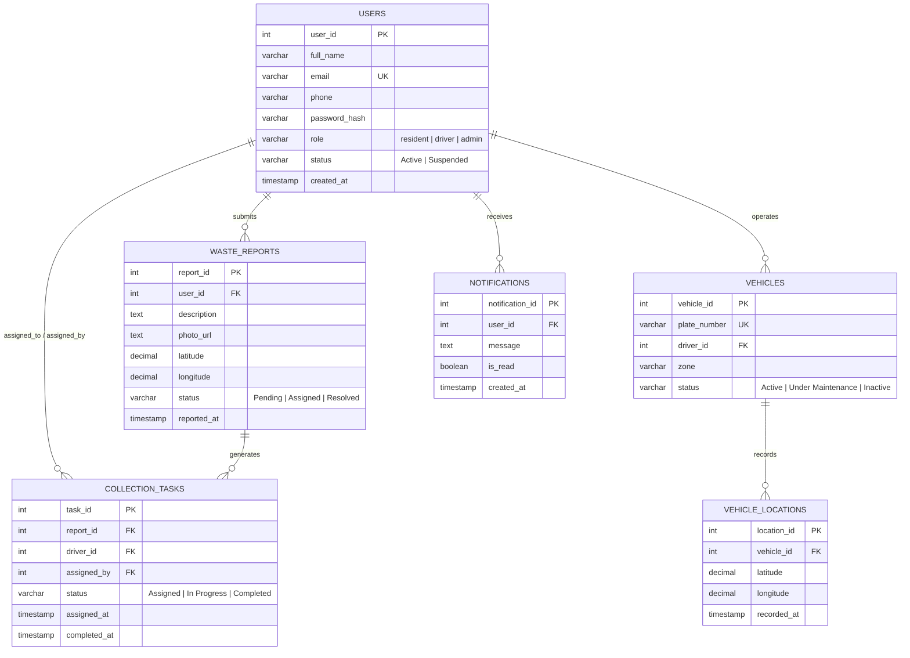

# Database Architecture & Data Dictionary

This document provides a comprehensive technical overview of the **ESWAMA Waste Management and Tracking System** database layer, powered by PostgreSQL (Neon Serverless Postgres).

---

## 1. Database Overview

- **Engine:** PostgreSQL 16+ (Neon Serverless)
- **Driver:** `pg` (node-postgres) with SSL connection pooling
- **Primary Design Goal:** High-speed spatial queries, relational integrity, real-time notification lookups, and audit logging.

---

## 2. Entity-Relationship Diagram (ERD)



---

## 3. Data Dictionary & Table Schemas

### 3.1 `users`
Stores credentials, contact information, role-based access classifications, and account lifecycle status.

| Column | Data Type | Constraints | Description |
| :--- | :--- | :--- | :--- |
| `user_id` | `SERIAL` | `PRIMARY KEY` | Unique identifier for each user |
| `full_name` | `VARCHAR(100)` | `NOT NULL` | User's complete legal name |
| `email` | `VARCHAR(100)` | `UNIQUE, NOT NULL` | Login email address |
| `phone` | `VARCHAR(20)` | `NOT NULL` | Contact telephone number |
| `password_hash`| `VARCHAR(255)` | `NOT NULL` | Bcrypt hashed password (10 salt rounds) |
| `role` | `VARCHAR(20)` | `CHECK (role IN ('resident', 'admin', 'driver'))` | Role-based authorization |
| `status` | `VARCHAR(20)` | `DEFAULT 'Active', CHECK (status IN ('Active', 'Suspended'))` | Account access status |
| `created_at` | `TIMESTAMP` | `DEFAULT NOW()` | Registration timestamp |

---

### 3.2 `waste_reports`
Stores reports submitted by residents regarding uncollected waste or illegal dumpsites.

| Column | Data Type | Constraints | Description |
| :--- | :--- | :--- | :--- |
| `report_id` | `SERIAL` | `PRIMARY KEY` | Unique report identifier |
| `user_id` | `INTEGER` | `REFERENCES users(user_id) ON DELETE CASCADE` | ID of the reporting resident |
| `description` | `TEXT` | `NOT NULL` | Detailed description of the waste issue |
| `photo_url` | `TEXT` | `NULLABLE` | Base64-encoded image data or CDN URL |
| `latitude` | `DECIMAL(10, 7)` | `NOT NULL` | GPS latitude coordinate |
| `longitude` | `DECIMAL(10, 7)` | `NOT NULL` | GPS longitude coordinate |
| `status` | `VARCHAR(20)` | `DEFAULT 'Pending', CHECK IN ('Pending', 'Assigned', 'Resolved')` | Workflow progress |
| `reported_at` | `TIMESTAMP` | `DEFAULT NOW()` | Submission timestamp |

---

### 3.3 `vehicles`
Represents physical waste collection compactor trucks and pickup units in the ESWAMA fleet.

| Column | Data Type | Constraints | Description |
| :--- | :--- | :--- | :--- |
| `vehicle_id` | `SERIAL` | `PRIMARY KEY` | Unique vehicle identifier |
| `plate_number`| `VARCHAR(20)` | `UNIQUE, NOT NULL` | Vehicle registration plate (e.g. `ENU-234-XY`) |
| `driver_id` | `INTEGER` | `REFERENCES users(user_id) ON DELETE SET NULL` | Currently assigned driver |
| `zone` | `VARCHAR(50)` | `NOT NULL` | Assigned municipal zone (e.g., Independence Layout) |
| `status` | `VARCHAR(20)` | `DEFAULT 'Active', CHECK IN ('Active', 'Under Maintenance', 'Inactive')` | Operational status |

---

### 3.4 `collection_tasks`
Tracks assignment of collection jobs from administrators to specific drivers.

| Column | Data Type | Constraints | Description |
| :--- | :--- | :--- | :--- |
| `task_id` | `SERIAL` | `PRIMARY KEY` | Unique task ID |
| `report_id` | `INTEGER` | `REFERENCES waste_reports(report_id) ON DELETE CASCADE` | Associated report |
| `driver_id` | `INTEGER` | `REFERENCES users(user_id)` | Driver responsible for collection |
| `assigned_by` | `INTEGER` | `REFERENCES users(user_id)` | Admin who assigned the task |
| `status` | `VARCHAR(20)` | `DEFAULT 'Assigned', CHECK IN ('Assigned', 'In Progress', 'Completed')` | Task state |
| `assigned_at` | `TIMESTAMP` | `DEFAULT NOW()` | Date and time task was assigned |
| `completed_at`| `TIMESTAMP` | `NULLABLE` | Date and time collection was finished |

---

### 3.5 `vehicle_locations`
High-frequency breadcrumb GPS tracking data published by active driver units.

| Column | Data Type | Constraints | Description |
| :--- | :--- | :--- | :--- |
| `location_id` | `SERIAL` | `PRIMARY KEY` | GPS log identifier |
| `vehicle_id` | `INTEGER` | `REFERENCES vehicles(vehicle_id) ON DELETE CASCADE` | Vehicle tracked |
| `latitude` | `DECIMAL(10, 7)` | `NOT NULL` | Current latitude |
| `longitude` | `DECIMAL(10, 7)` | `NOT NULL` | Current longitude |
| `recorded_at` | `TIMESTAMP` | `DEFAULT NOW()` | Exact timestamp of coordinate recording |

---

### 3.6 `notifications`
In-app persistent notification feed for residents, drivers, and administrators.

| Column | Data Type | Constraints | Description |
| :--- | :--- | :--- | :--- |
| `notification_id` | `SERIAL` | `PRIMARY KEY` | Unique notification ID |
| `user_id` | `INTEGER` | `REFERENCES users(user_id) ON DELETE CASCADE` | Recipient user ID |
| `message` | `TEXT` | `NOT NULL` | Notification message text |
| `is_read` | `BOOLEAN` | `DEFAULT FALSE` | Read status |
| `created_at` | `TIMESTAMP` | `DEFAULT NOW()` | Notification timestamp |

---

## 4. Performance Indexes

To ensure sub-millisecond query latency across thousands of reports and high-frequency GPS coordinate writes:

```sql
CREATE INDEX IF NOT EXISTS idx_waste_reports_status ON waste_reports(status);
CREATE INDEX IF NOT EXISTS idx_waste_reports_user ON waste_reports(user_id);
CREATE INDEX IF NOT EXISTS idx_collection_tasks_driver ON collection_tasks(driver_id);
CREATE INDEX IF NOT EXISTS idx_collection_tasks_status ON collection_tasks(status);
CREATE INDEX IF NOT EXISTS idx_vehicle_locations_vehicle ON vehicle_locations(vehicle_id, recorded_at DESC);
CREATE INDEX IF NOT EXISTS idx_notifications_user ON notifications(user_id, is_read);
```

---

## 5. Proximity Algorithm (Haversine Formula)

Nearest-driver matching computes geodesic distance between report coordinates $(\phi_1, \lambda_1)$ and vehicle coordinates $(\phi_2, \lambda_2)$:

$$d = 2r \arcsin \left( \sqrt{\sin^2\left(\frac{\Delta\phi}{2}\right) + \cos(\phi_1)\cos(\phi_2)\sin^2\left(\frac{\Delta\lambda}{2}\right)} \right)$$

Where $r = 6371\text{ km}$ (Earth radius).
